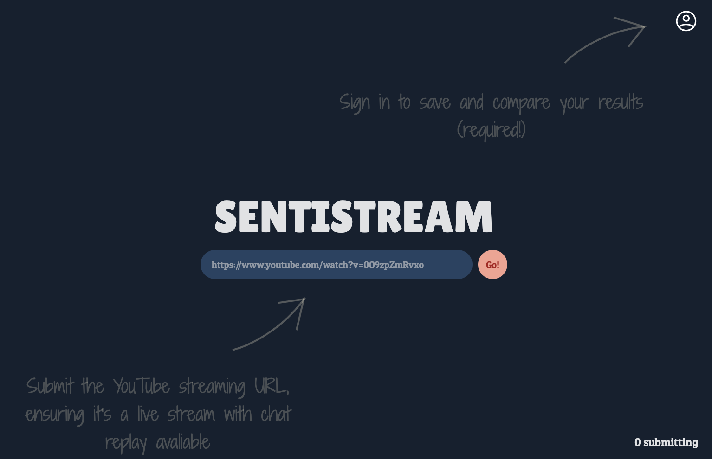
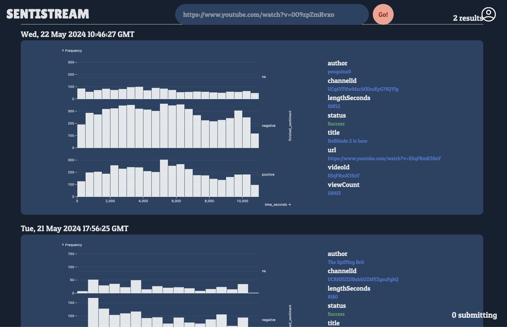
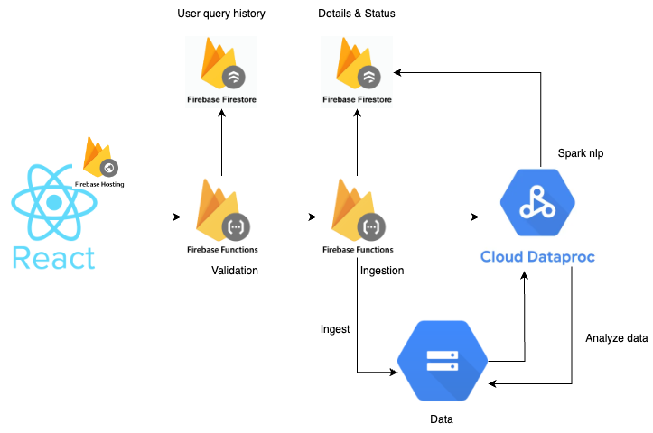
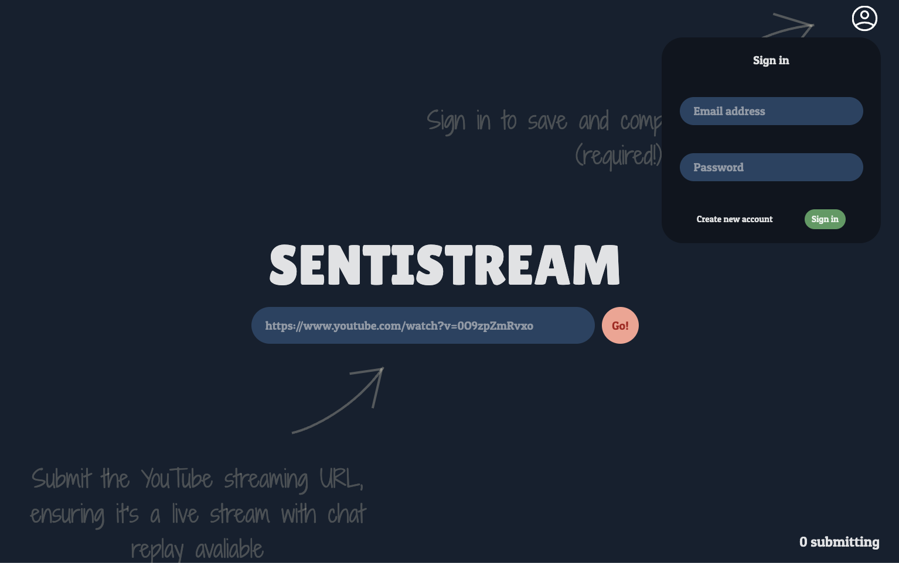
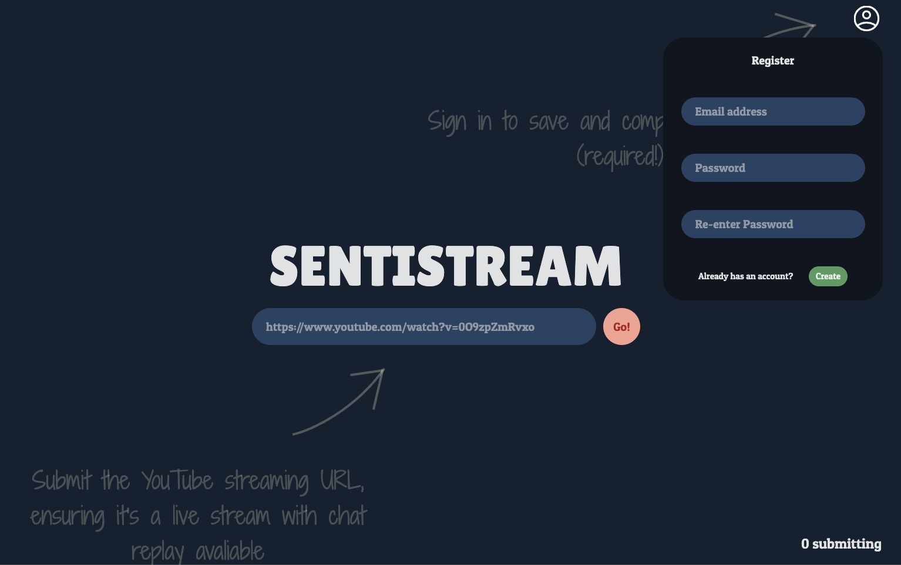
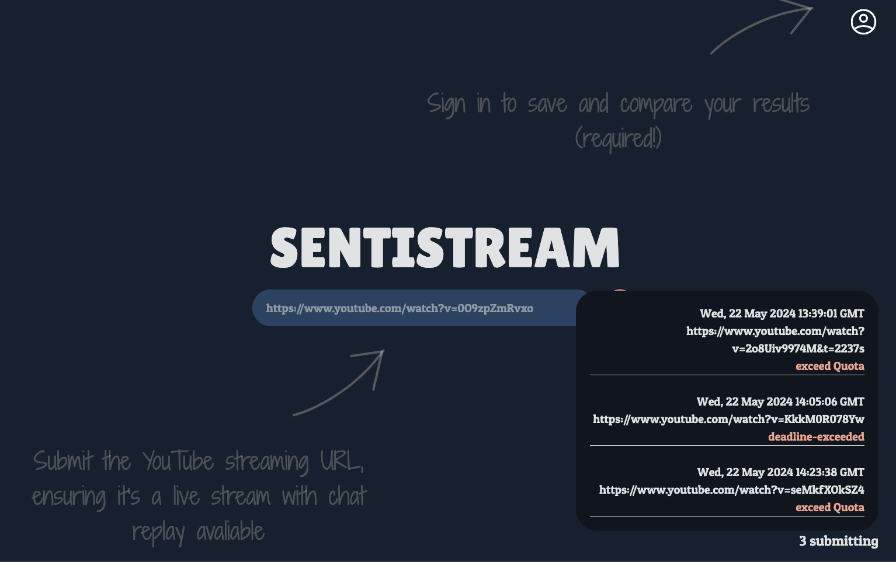
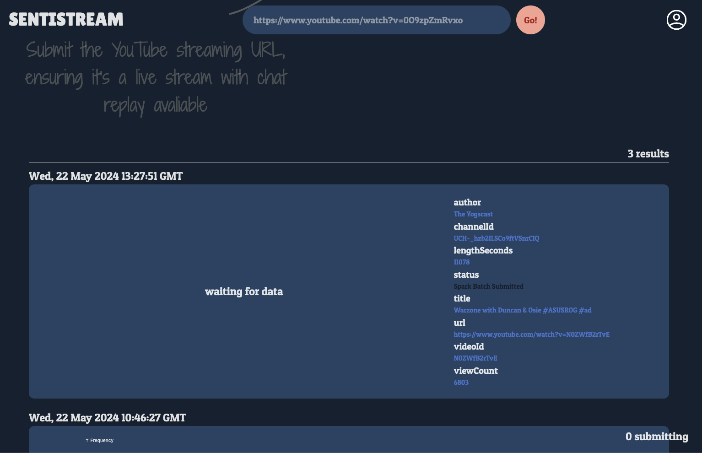
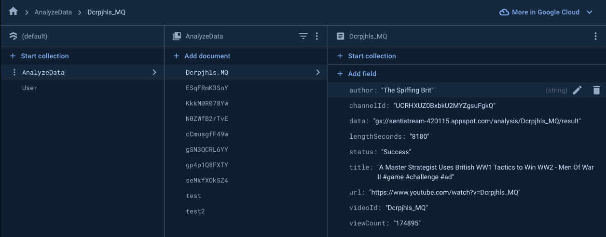
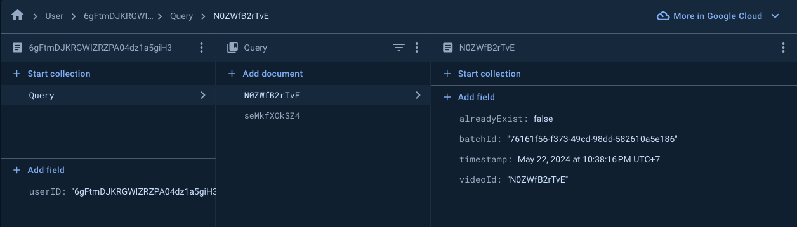

# Sentistream: Chat sentimental analyzer
### Ingest and analyze all in one click! [Sentistream](https://sentistream-420115.web.app/)

    
    

## Limitation
- Currently only support ended Youtube live chat with chat replay enabled.
- Each user is limited to two call per 24 hrs.
- Since this is personal project only two batchs can run simultaneously.
- The current version only used English sentiment analysis pretrained pipeline from Spark NLP.
- Each analysis take roughtly 10mins this is due to image pulling for dataproc batch. 

## Future features
- add bin value adjustment 
- add download button to download the result
- reduce analyzing time
- support multiple languages
- reposive for mobile
- etc

# About the project
The project is hosted and managed on google cloud platform

    

## React & Firebase authentication

The web application is bulit using React, integrated with Firebase services including Firebase authentication, Firestore and Firebase Cloud Storage. Observable plot is used to visualize graphs

*User are required to authenticate before using the service. 

    
    

User can track analysis progression during summiting and analyzing

    
    

## Validation Function
The user exposed function written on NodeJS. 
### The verification process
- Verify if user is authenticated and email verified
- Verify if user exceed the call quota
- Verify if the provided URL is valid

If everything is verified, The video metadata is then extracted. Next, the function check if the result already exists within the result database, if so, the function add result reference to user database, else, the function trigger analyze function. 

## Analyze Function
The python function accessable only from validation function
- ### Ingest
    The function use Chatdownloader library to download chat data and store it in Avro format in cloud storage

- ### Submit Dataproc batch
    After finished ingestion, the function submit Dataproc batch and proceed to wait untill Dataproc started.

## Dataproc batch
Because of the inclusion of Spark NLP and firebase-admin a custom docker image is needed.

The spark batch read from provided path and then analyze using Spark NLP pretrained pipeline. Any message that is unable to analyzed is dropped.

## Firestore

Firestore is used to store mainly two type of document

- ### Document storing video metadata and current status
    After the document is created, status of the process is tracked at every component and updated to the documents. The data value points to the location in which the result data is stored.
   
    

    
    

    

- ### Document storing user call data
    The document store time and videoId in which user call the function. BatchId is collected as well to diagnose possible error.
    

    
    

    This document is also used to in quota implementation

## Cloud Storage
This is use to store ingestion data from analyze function as well as the result from dataproc batch